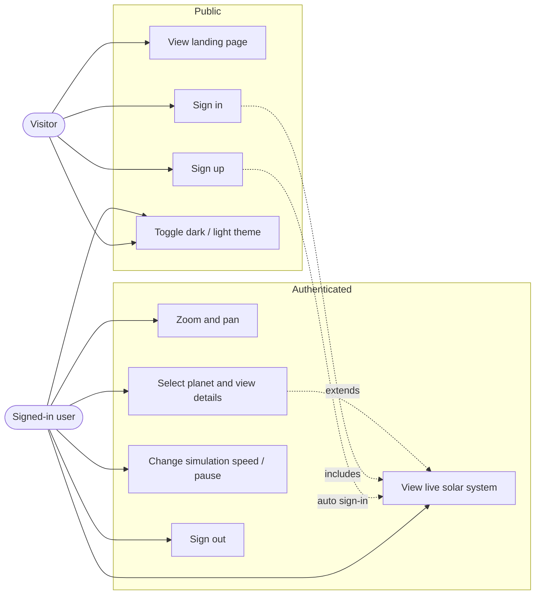
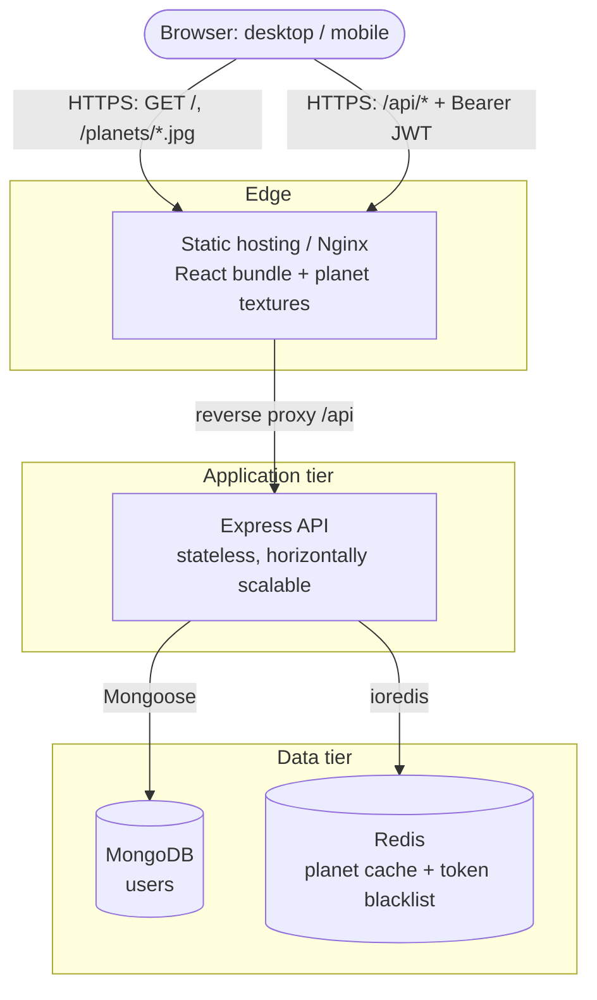
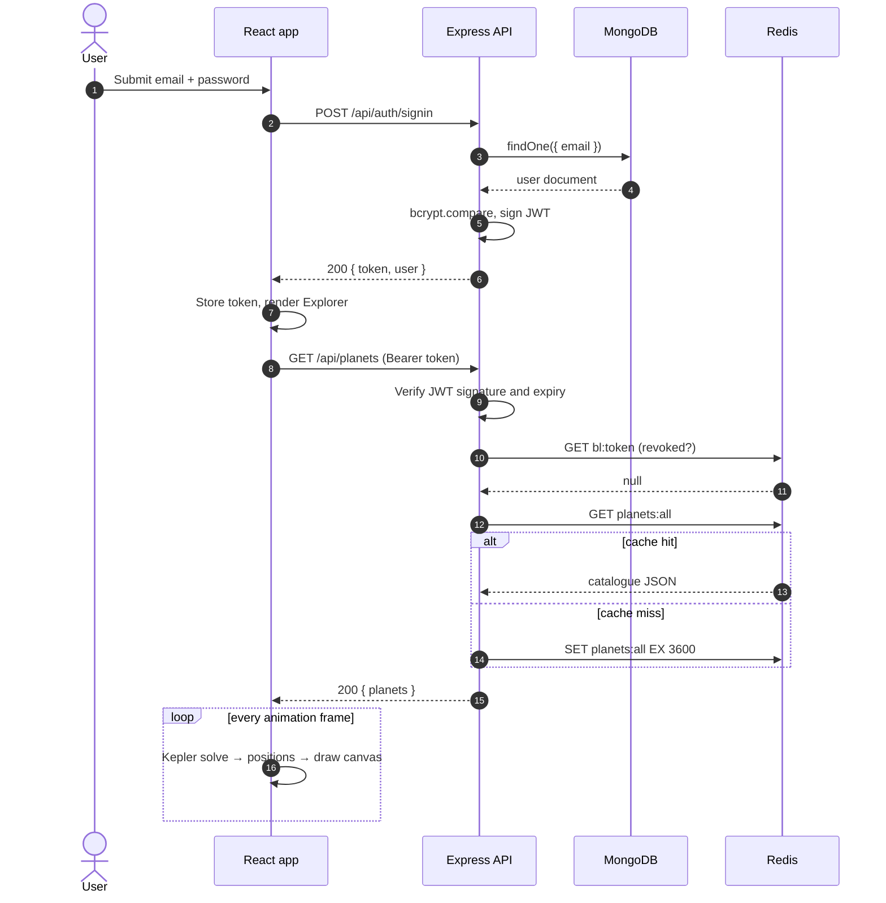
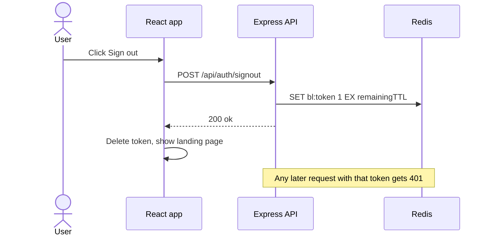
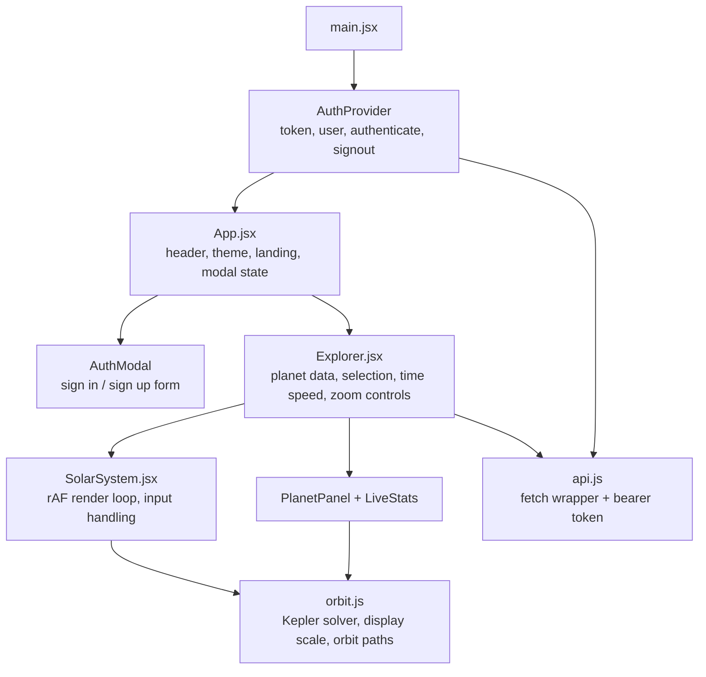
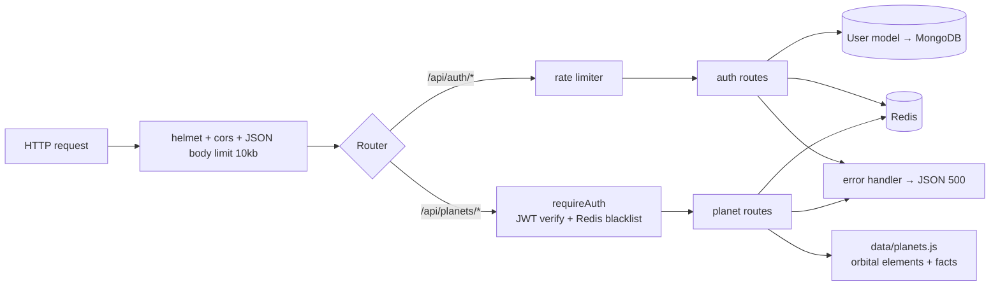
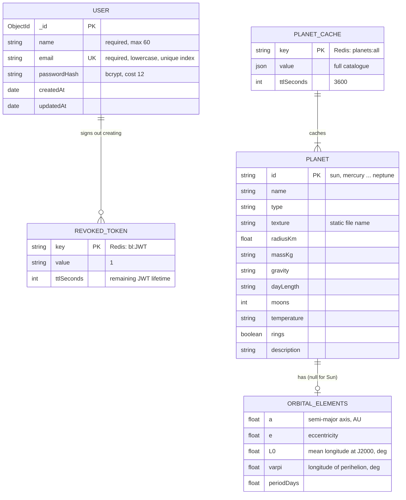
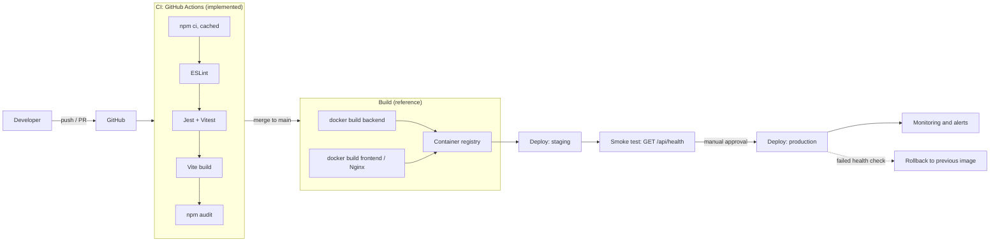
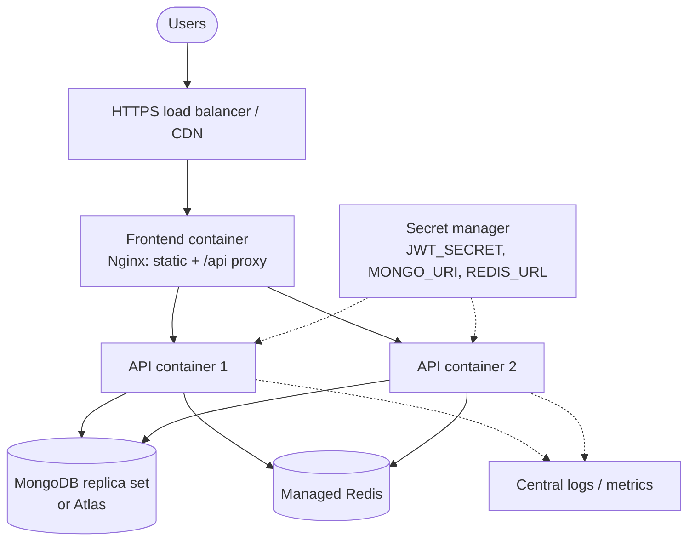

# Orbit — Live Solar System

A full-stack, authenticated web app that renders the Solar System in real time. Planet positions are computed from real Keplerian orbital elements for the current UTC time, and every body has a detail view with live telemetry.

**Stack:** React 18 (Vite) · Node.js 20 / Express 4 · MongoDB 7 (Mongoose) · Redis 7 (ioredis) · JWT · Jest / Supertest · Vitest · ESLint 9 · GitHub Actions · Docker

> Diagrams are written in [Mermaid](https://mermaid.js.org) and render natively on GitHub, GitLab and most Markdown viewers.

---

## Table of contents
1. [Features](#1-features)
2. [Use cases](#2-use-cases)
3. [System design](#3-system-design)
4. [Application architecture](#4-application-architecture)
5. [Data model (ER diagram)](#5-data-model)
6. [API reference](#6-api-reference)
7. [Real-time engine](#7-real-time-engine)
8. [Security](#8-security)
9. [DevOps: CI/CD architecture](#9-devops-cicd-architecture)
10. [Getting started](#10-getting-started)
11. [Configuration](#11-configuration)
12. [Testing and linting](#12-testing-and-linting)
13. [Project structure](#13-project-structure)
14. [Known limitations and roadmap](#14-known-limitations-and-roadmap)

---

## 1. Features

| Area | Capability |
|---|---|
| Simulation | Sun + 8 planets on elliptical orbits, positions from Kepler's equation at the current UTC time |
| Time control | Live (1×), 1 day/s, 10 days/s, 1 month/s, 1 year/s, pause |
| Navigation | Wheel zoom (toward cursor), drag pan, pinch zoom, +/−/reset buttons, click-to-follow |
| Detail view | Description, radius, mass, gravity, day length, moons, temperature, live distance, orbital speed, light travel time |
| Imagery | NASA-derived texture maps rendered as rotating, Sun-lit spheres; Saturn rings; name captions |
| Auth | Sign up / sign in / sign out, bcrypt-hashed passwords, JWT sessions, server-side revocation via Redis |
| UX | Dark / light theme (persisted, respects OS preference), responsive layout, touch support |
| Quality | Unit tests, linting, CI pipeline |

## 2. Use cases



| ID | Use case | Actor | Main flow | Alternate / error flows |
|---|---|---|---|---|
| UC-1 | Sign up | Visitor | Enter name, email, password (≥ 8 chars) → account created → JWT issued → solar system opens | Invalid email/password → 400; email exists → 409 |
| UC-2 | Sign in | Visitor | Enter email + password → JWT issued → solar system opens | Wrong credentials → 401 (same message for unknown email and wrong password) |
| UC-3 | View live system | User | App fetches planet catalogue → canvas animates from real time | Expired/revoked token → 401 → user is signed out |
| UC-4 | Inspect planet | User | Click planet or dock icon → camera follows and zooms → panel shows live telemetry | Click empty space → deselect |
| UC-5 | Time travel | User | Choose speed preset or pause; "Live" resyncs to real time | — |
| UC-6 | Sign out | User | Token blacklisted in Redis until its natural expiry | Redis unavailable → local sign-out still succeeds |

## 3. System design

### 3.1 Context and containers



**Key design decisions**

| Decision | Rationale |
|---|---|
| Positions computed client-side | Deterministic maths from orbital elements + clock; no server round-trips, no WebSocket load, works at any time-speed |
| Stateless API + JWT | Any API replica can serve any request; scales horizontally |
| Redis token blacklist | Gives JWTs real sign-out semantics; keys expire with the token (TTL = remaining lifetime) |
| Redis planet cache (1 h TTL) | Catalogue is read-heavy and immutable; cache is best-effort and falls back to in-process data |
| Textures served as static assets | Cacheable at the CDN; not fetched from third parties at runtime |
| Canvas 2D rendering | No heavy 3D dependency; smooth on mobile; full control of scale and labels |

### 3.2 Sequence: sign in and load the solar system



### 3.3 Sequence: sign out



### 3.4 Scalability and reliability notes
- **API tier:** stateless; add replicas behind a load balancer. Rate limiting is per-instance in the current code; use a Redis-backed store (e.g. `rate-limit-redis`) for a shared limit across replicas.
- **Redis:** used only for cache and revocation. Cache failures are swallowed (best-effort). If Redis is down, the blacklist check throws and requests are rejected (fail-closed), which is the safer default for auth.
- **MongoDB:** a unique index on `users.email` enforces uniqueness. Use a replica set in production.
- **Frontend:** static; put it behind a CDN. Textures are content-addressable candidates for long-lived caching.

## 4. Application architecture

### 4.1 Frontend



Design notes:
- **Imperative canvas, declarative UI.** The 60 fps loop reads mutable refs (`view`, `sim`) instead of React state, so animation never triggers re-renders. React state updates only ~5×/s (`onTick`) for the clock and telemetry.
- **`orbit.js` is pure** (no DOM, no React), so it is fully unit-tested.
- **Theme** is a `data-theme` attribute driving CSS variables; the canvas palette switches with it.

### 4.2 Backend



Layers: **middleware** (cross-cutting) → **routes** (validation, orchestration) → **models / data** (persistence). External services are isolated in `src/redis.js` and `src/models/`, which lets tests mock them.

## 5. Data model

MongoDB stores one collection. The planet catalogue is static reference data in code, cached in Redis; Redis keys are shown as logical entities for completeness.



## 6. API reference

Base URL: `/api`. Errors are JSON: `{ "error": "message" }`. Protected routes need `Authorization: Bearer <token>`.

| Method | Path | Auth | Body | Success | Errors |
|---|---|---|---|---|---|
| GET | `/health` | — | — | `200 { status: "ok" }` | — |
| POST | `/auth/signup` | — | `{ name, email, password }` | `201 { token, user }` | 400 validation, 409 duplicate |
| POST | `/auth/signin` | — | `{ email, password }` | `200 { token, user }` | 401 invalid credentials |
| POST | `/auth/signout` | ✔ | — | `200 { ok: true }` | 401 |
| GET | `/auth/me` | ✔ | — | `200 { user }` | 401 |
| GET | `/planets` | ✔ | — | `200 { planets: [...] }` | 401 |
| GET | `/planets/:id` | ✔ | — | `200 { planet }` | 401, 404 |

`user` is `{ id, name, email }`; the password hash is never returned.

## 7. Real-time engine

For each planet with elements `(a, e, L0, ϖ, T)` and time `t`:

1. Days since J2000: `d = (t − 2000-01-01T12:00Z) / 86 400 000`
2. Mean anomaly: `M = (L0 − ϖ) + 360°·d / T`
3. Solve Kepler's equation `M = E − e·sin E` (Newton–Raphson)
4. True anomaly `ν = 2·atan2(√(1+e)·sin(E/2), √(1−e)·cos(E/2))`, radius `r = a(1 − e·cos E)`
5. Heliocentric longitude `= ν + ϖ` → `(x, y) = r·(cos, sin)`
6. Orbital speed (vis-viva): `v = 29.7847·√(2/r − 1/a)` km/s

**Display scaling:** screen radius `= 120 · r^0.55` so Mercury and Neptune both fit. Planet sizes are log-scaled and exaggerated. Shown positions (angles) are accurate; distances and sizes are not to scale.

**Accuracy:** two-body model with J2000 mean elements. Expect arc-minute to sub-degree errors over decades; it ignores planetary perturbations and element drift.

## 8. Security

| Concern | Control |
|---|---|
| Password storage | bcrypt, cost 12; minimum length 8 |
| Session | JWT (default 7 d), signed with `JWT_SECRET`; server refuses to start without it |
| Revocation | Redis blacklist with TTL matching remaining token life |
| Brute force | Rate limit on sign in/up (50 requests / 15 min per IP, per instance) |
| User enumeration | Identical error for unknown email and wrong password |
| HTTP hardening | `helmet`, strict CORS origin, 10 kb body limit |
| Dependencies | `npm audit` in CI |

Before production: serve over HTTPS only; consider httpOnly-cookie sessions instead of `localStorage` (mitigates XSS token theft); add a CSP; use a Redis-backed shared rate limiter; rotate `JWT_SECRET` via a secret manager.

## 9. DevOps: CI/CD architecture

### 9.1 Pipeline

`.github/workflows/ci.yml` (implemented) runs lint, tests, build and audit. The image build and deploy stages are the reference target: Dockerfiles are provided, but registry and environment wiring is yours to add.



### 9.2 Runtime deployment (reference)



Environments: **local** (docker compose for Mongo + Redis), **staging** (auto-deploy from `main`), **production** (manual approval). The `frontend/nginx.conf` proxies `/api` to a host named `backend`, so name the API service accordingly (or edit the file).

## 10. Getting started

Prerequisites: Node.js ≥ 20, Docker (or local MongoDB + Redis).

```bash
docker compose up -d                                          # MongoDB :27017, Redis :6379

cd backend
cp .env.example .env                                          # then set JWT_SECRET
npm install && npm run dev                                    # API on :4000

cd ../frontend
npm install && npm run dev                                    # App on :5173 (proxies /api to :4000)
```

Open http://localhost:5173, sign up, and the live solar system loads.

## 11. Configuration

| Variable | Default | Description |
|---|---|---|
| `PORT` | `4000` | API port |
| `MONGO_URI` | `mongodb://localhost:27017/solar` | MongoDB connection string |
| `REDIS_URL` | `redis://localhost:6379` | Redis connection string |
| `JWT_SECRET` | — (required) | Signing key; use a long random value |
| `JWT_EXPIRES_IN` | `7d` | Token lifetime |
| `CLIENT_ORIGIN` | `http://localhost:5173` | Allowed CORS origin |
| `VITE_API_URL` (frontend) | `/api` | API base URL if not proxied |

## 12. Testing and linting

```bash
cd backend  && npm test && npm run lint     # 10 tests
cd frontend && npm test && npm run lint     # 8 tests
```

| Suite | Covers |
|---|---|
| `backend/tests/api.test.js` | Signup validation and duplicates, sign in success/failure, auth guard, planet list + Redis caching, 404, token revocation, sign out. MongoDB and Redis are mocked, so no services are needed |
| `frontend/src/orbit.test.js` | Kepler solver residuals (including e = 0.9), Earth's perihelion distance, perihelion/aphelion bounds, orbital periodicity, vis-viva speed, orbit path closure, API client (auth header, error mapping) |

Not yet covered: React component tests, end-to-end tests (e.g. Playwright), integration tests against real MongoDB/Redis.

## 13. Project structure

```
.
├── .github/workflows/ci.yml
├── docker-compose.yml              # local MongoDB + Redis
├── backend/
│   ├── Dockerfile
│   ├── src/
│   │   ├── app.js                  # Express app (importable for tests)
│   │   ├── server.js               # bootstrap: Mongo, Redis, listen
│   │   ├── redis.js
│   │   ├── data/planets.js         # orbital elements + facts
│   │   ├── middleware/auth.js
│   │   ├── models/User.js
│   │   └── routes/{auth,planets}.js
│   └── tests/api.test.js
└── frontend/
    ├── Dockerfile, nginx.conf
    ├── public/planets/*.jpg        # NASA-derived texture maps
    └── src/
        ├── App.jsx, main.jsx, styles.css
        ├── AuthContext.jsx, AuthModal.jsx, api.js
        ├── Explorer.jsx            # state, HUD, dock, detail panel
        ├── SolarSystem.jsx         # canvas renderer and input
        └── orbit.js, orbit.test.js # orbital mechanics + tests
```

## 14. Known limitations and roadmap

- Distances and sizes are display-scaled; moons, dwarf planets and asteroids are not included.
- The Sun is a textured disc with glow, not a 3D render.
- Sessions are stored in `localStorage`; no refresh tokens, password reset or email verification.
- Rate limiting is per instance.
- The CD stages and Dockerfiles are reference implementations and have not been run end to end.

Roadmap ideas: moons and dwarf planets, WebGL/three.js renderer, search and guided tours, refresh-token / httpOnly cookie auth, OAuth providers, Playwright end-to-end tests, Prometheus metrics and structured logging.

## Credits
Planet texture maps from the [threex.planets](https://github.com/jeromeetienne/threex.planets) project (derived from NASA imagery). Orbital elements are J2000 mean elements from public NASA/JPL data. Check the upstream licence terms before redistributing commercially.
